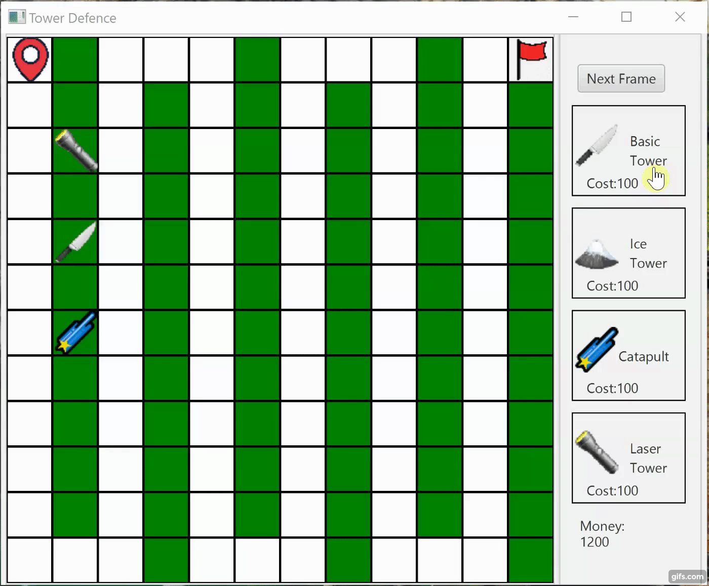

## Introduction
This Tower Defense game was meant to be a project to learn Software Engineering techniques, Java, GUI implementation using JavaFX, Gradle, JavaDocs, perform tests and work together on a project using Git.

There are different Towers with certain features that can be upgraded. The different monsters have different capabilities and get stronger over time.

## Example Game

